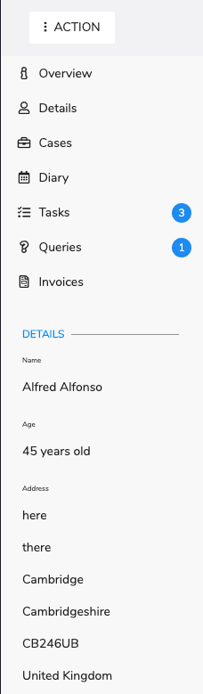

# Client Navigation

## Overview

After clicking on the client you will see the client navigation and client overview. 

### Heading

On the left side is the clients name and after the dot is the page that you are viewing - initially this will be the overview page.

### Navigation Bar

This is split into three main areas the action button, the menu buttons and details overview.

#### Action Button

On clicking this you will be presented with a list of actions:

|  |  |
| :--- | :--- |
| [Log Call]() | Opens the call log dialog |
| [Create Correspondence](action/create-correspondence.md) | Opens the create Correspondence page |
| [Fill Word Template]() | Opens the fill word template dialog |
| [Add Appointment]() | Opens the Add appointment dialog |
| [Delete Client]() | Deletes client |

#### Menu Buttons

|  |  |
| :--- | :--- |
| Overview | This is where you start showing client details |
| Details | This is where you can edit client details and access full details |
| Cases | This is where you can view the client cases |
| Diary | This is where you can view the clients appointments |
| Tasks | This is where you can see all tasks relating to the client \(the number refers to the number of open tasks\) |
| Queries | This is where you can see all open queries related to the client \(the number refers to all open queries\) |
| Invoices | This is where you can see all invoices related to the client. |

#### Details

This gives a few simple details about the client.

