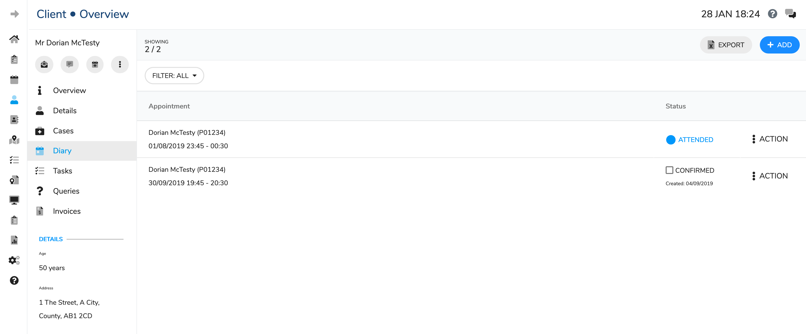

# Diary

This page will show any appointments past or future for a client.

You can confirm an appointment by clicking on the "confirmed" status box on the right side of the screen. This will then fill blue with a white tick to indicate that it is a confirmed appointment.

## Changing an appointment

Click on the Action option on the far right of the screen

Select Edit from the drop down list, this will open a pop-up window

·      You can change the **Clinic** on this page e.g. if there is a more convenient location for the client

·      You can also change the **Appointment Type** on this page e.g. if it has come to light that this is a clinical negligence case.

·      Select date

This has a toggle switch to change the view between the appointment date list \(this shows dates of free slots for the selected clinician and the selected location\) or calendar view.

·      Click on the required **date** to see a list of the available appointment times

·      Click on the required **time**

·      Tick **confirmed** if the client has confirmed they can make the amended time e.g. if you are arranging the appointment with the client on the phone

·      Click on **Save**

 

