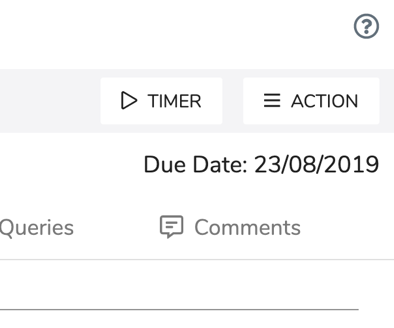
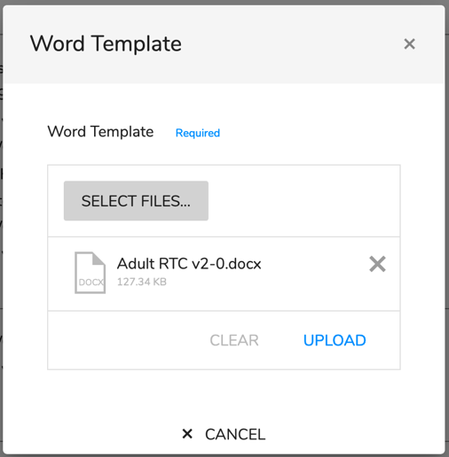

# Fill Word Template

When you have a task to write a report the task will appear in your list. Click on the task you want to complete a report for to open the task page

At the top right of the screen is an **Action** button \(see below\)

Click on this button to active a drop down list and select **Fill Word Template.** This will open a pop-up window **Word Template.**

Once open you will need to click on the **Select Files...** button, navigate to the templates and **open** the required template. This will return you to the pop-up which will now show the selected template \(Adult RTC v2-0.docx in this example\).

Click on **UPLOAD**

Within no more than 2 seconds the word document will be created. Depending on your computer's configuration you will either see the document or will be prompted to open the file using word - if prompted click **OK** to open in Word.

You will now have a template open which has a pre-populated fields such as Claimant name, full name, DoB, Address, etc. You can now continue with the normal transcription of the report.

