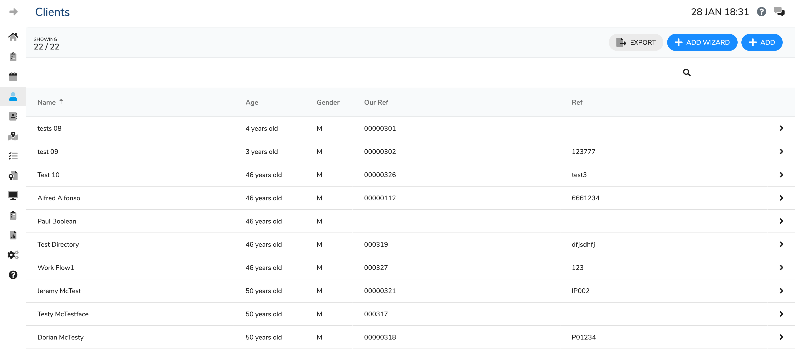

# Clients List

When you select "Clients" from the main hand menu you will be presented with a list of all clients. From this page you can Seach for a client, or add either using the [+Add button](add.md) or the [+Add Wizard](addwizard.md).

