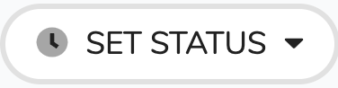
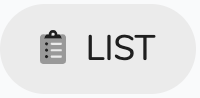
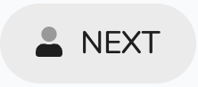
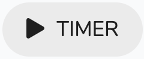

# Appointment Details

## Overview

This is the area is to support the clinician during the appointment. It contains a header section and a tabs section.

### Header

This area has basic information and the available actions. 

The information is:

* On the top of the section is the progress showing how many you have seen or did not attend over how many are in the clinic \(e.g. 1/3 Complete\).
* Then on the row down is the clients name on the left and the appointment slot is on the left \(e.g. 09:15 - 10:00\)

The actions are:

| Action | Purpose |
| :--- | :--- |
|   | This is the most important as setting the status triggers the systems to [perform tasks](details.md#activating-the-task-templates). The statuses are: Attended, Arrived, Did not attend, Cancelled. |
|   | Reopens the list so you can see or select another client. |
|   | Opens the next clients appointment. |
|   | This is a timer to show how long you have been in the session. |

### The Tabs

This area has a several tabs which cover different areas. Below is a description of each area:

| Tab | Description |
| :--- | :--- |
| Overview | Gives a brief set of information about the client, the case and the incident and an area for comments \(These are for administration not clinical notes\). |
| Client | This is the client details page. |
| Notes | You can add notes on the session here. |
| Documents | You can upload case documents here. \(e.g. hand written notes scanned in session\) |
| Charges | Shows the charges related to this appointment |

### Activating the task templates


It is important to set status it is a key component to supporting the admin staff.


When the clinician sets appointment status to 'Attended' then the user will be asked if they want to activate the associated task template. If the user responds in the affirmative  then they will be activated.

If the clinician then changes their mind and changes the status back then the created tasks will be removed.

If the clinician set the attendance status to 'Did not Attend' \(DNA\) then then DNA task template will initiated. The default template for the [DNA task template]() is set in general settings.

### How to use



## Walkthroughs

[How do I complete an appointment?](faq/how-do-i-complete-an-appointment.md)

[How do I time the appointment?](faq/how-do-i-time-the-appointment.md)

