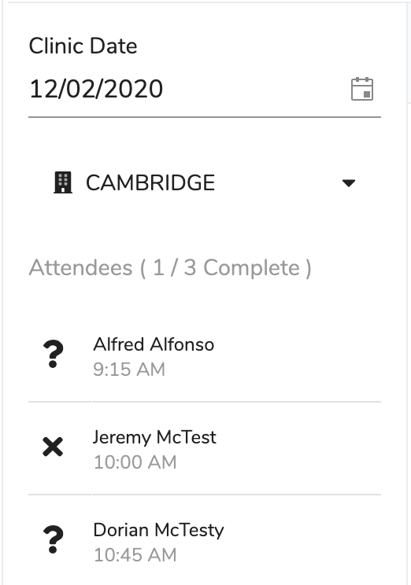

# Appointment List

## Overview

This is where you see your clients for the clinic you are running.

This consists of two main areas:

* The top section is for selecting the venue and date but really should only be needed when viewing clinics in the future. If you are selecting the clinic date then the dates with clinics set have a small blue dot under them.
* The bottom section has a header which shows the progress through the clients and below that is the list of clients that are to attend the clinic. The icon next to each client signifies the status of the appointment and the appointment status can be set by clicking on the icon \([see appointment details](details.md)\). The icons definitions are below \(hovering the mouse pointer over the icon will reveal the status too\):

  | Icon | Meaning |
  | :--- | :--- |
  |  | Awaiting - This is the appointments initial status |
  |  | Arrived - This is an optional status and only applies if you are using a front desk to register that someone has arrived at the premises . |
  |  | Did Not Attend/Cancelled |
  |  | Attended |

## Walkthroughs

[How do I open the appointment?](faq/how-do-i-open-the-appointment.md)

[How do I view my clinic appointments?](faq/how-do-i-view-my-clinic-appointments.md)

1. 
