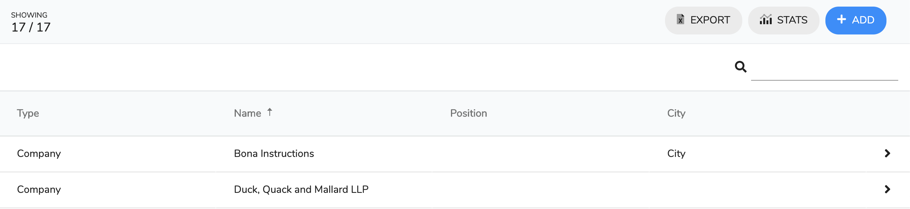

# Contact List

## Overview

The page is split into three areas:

1. ToolBar
2. Filter Bar
3. Contact List

### Toolbar

The toolbar has on the left shows the number of contacts. It is split into the number on contacts showing versus what is available.

The right hand side has three buttons:

| Button | Purpose |
| :--- | :--- |
|   | This exports the client list to a pdf |
|   | This opens the clients stats page |
|   | This open the Add client page |

### Filter Bar

This has one field to enter a text filter indicated by a  icon. This will filter the contact list by any text entered into this field.

### Contact List

This is the list of available contacts. If you wish to open one click the line.

