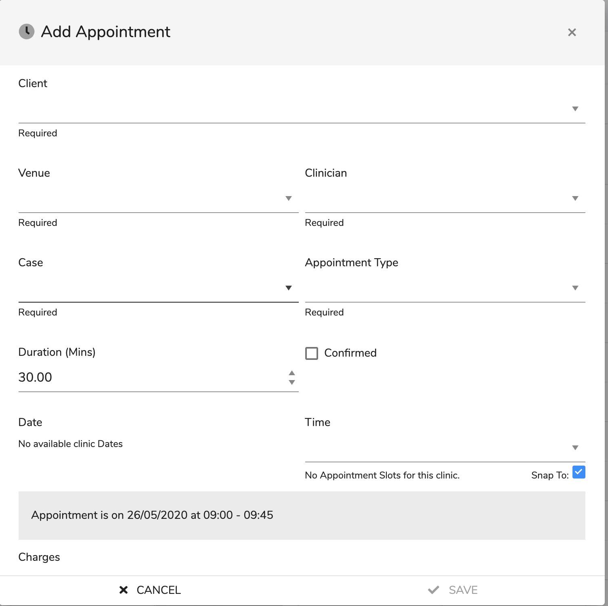
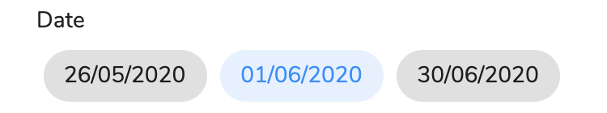
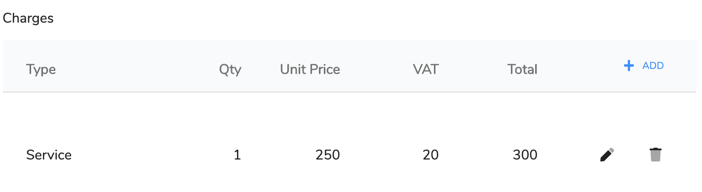

# Add/Edit Appointments

## Overview

This is where you add or Edit an appointment. The appointment contains information not only about the appointment but about costs and what happens if the appointment is attended or not.

## How Do I add a new appointment?



There are a few methods of adding a new appointment:

* Via the client wizard \([See Client Add Wizard](../clients/overview-1/addwizard.md)\). This is completely dealt with on the Add Wizard page and is not covered here. 
* Via the schedular \([See Diary](./#overview)\)
* Via the client diary \([See Client Diary](../clients/client-navigation/diary/)\)

1. Click on  in client diary or in the main diary either click on an appointment labeled 'Empty Slot' or select '  Add Appointment' from the action menu on the toolbar.
2. A dialog will open. If the appointment was selected by using the client diary then the client details will be filled in and if from the 'Empty Slot' then fill in clinic information.  
3. \[**Required**\] The first field is 'client' and is selectable from a drop down list. The list will be filtered if the dialog was selected from the 'Empty Slot' by using the clinic venue. It is important to note that the client has a default venue and clinician set up and these will automatically fill in the next 2 fields.
4. \[**Required**\] This next field is the venue and defines where the appointment will take place.
5. \[**Required**\] Then is the **Clinician** field and this defines which the clinician the client will see.
6. \[**Required**\] The **Case** field will automatically fill in if the client has only one case, otherwise you can select from the drop down list.
7. \[**Required**\] The **Appointment Type** is selectable from a drop down list. The appointment type defines many features of the appointment. \([See Appointment Type](../overview/appointment-types.md)\). When you select this it will define some information in the appointment. \(Such as what happens when the appointment is attended\). It will also set the appointment duration and the charges assigned to the appointment.
8. **Duration \(min\)** sets the length of the appointment. So automatically setting the end time.
9. **Confirmed** sets whether the client has confirmed that they will attend.  
10. **Date** sets the appointment dates by clicking the required available clinic date \(see above\)
11. The **Time** dropdown enables the selection of the time slot. The time slots are set by the durations and the available time. They also give freedom to overlap with breaks or day end. If you don't want to use the defined slots then untick **Snap To** to change the slots to be 5 minutes apart, it will still prevent the use of already taken space but gives more freedom. The information panel shows you the selected appointment and whether or not it overlaps with a break or the end of a day.  
12. The final area **Charges** are for adding charges to the appointment. It will be automatically be updated from the appointment type, however you can add additional charges.
13. Click  **SAVE** to save appointment or  **CANCEL** to exit without saving.

## How do I edit an appointment?

There are a few methods to edit an appointment:

* Via the schedular \([See Diary](./#overview)\)
* Via the client diary \([See Client Diary](../clients/client-navigation/diary/)\)

1. In the client diary click on the ellipses at the end of the relevant entry and click edit or in the main diary either click on an active appointment and then from the appointment view click the  . For the fields description see above.

