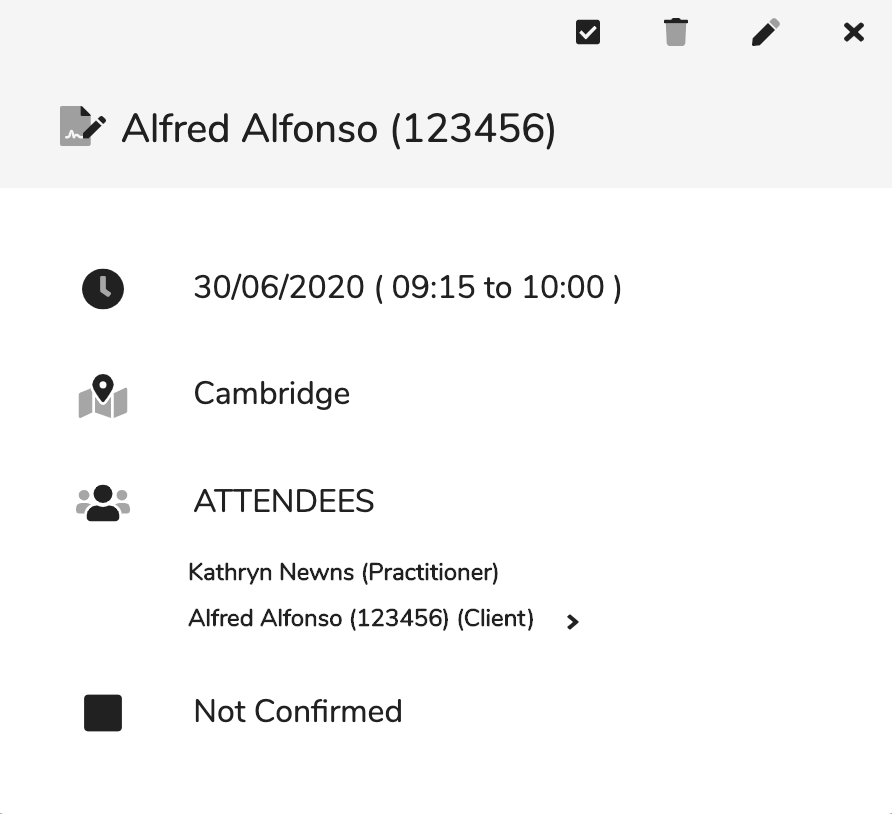

# View Appointment

## Overview

From the diary view you can view the appointment details without going into the edit appointment dialog. This gives access to view details and active some functions.

This are three sections in the view appointment:

1. Actions Toolbar
   1.   Confirm/ Un-confirm appointment - You can confirm or un-confirm an appointment by clicking this.
   2.  Delete appointment - Delete the appointment.
   3.  Edit appointment - Edit the appointment.
   4.  Close dialog
2. Header - The title of the appointment. 
3. Information
   1.  The date and time of the appointment.
   2.  The venue of the appointment.
   3.  Attendees - It shows the practitioner and client. The client has an arrow next to jump to the clients details.
   4. The confirmed status of the appointment:  Unconfirmed  Confirmed

## How to view the appointment view

1. Click on an appointment in the diary view to view appointment details.

## How to confirm/un-confirm an appointment

1. Click on the first button in the header. If the button appear as  then it will confirm the appointment and if appears as then it will set the appointment as unconfirmed.

