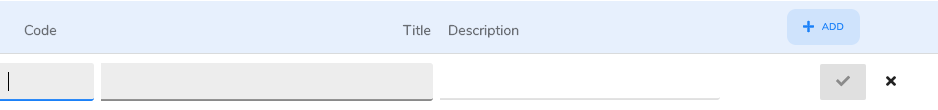

# Diagnostic Frameworks

## What are Diagnostic Frameworks?

The diagnostic frameworks are a list of diagnosis. The list includes the code, the title and the description. This is assigned to a client after diagnosis has occurred by the clinician.

## How to create a Diagnostic Framework? 

1. Under settings choose 'Diagnostic Frameworks'
2. Click the Add button and you will the Diagnostic Framework Form.
3. You will need to give the template a name, preferably something that is meaningful to its purpose.
4. \[Optional\] You can add a description. This is optional and is there as an aide memoire.
5. Now you can add the diagnosis entries. 
6. Once you have added all the diagnosis's then click the  Save button and you will be taken back to the list.

## How do I add/edit a diagnosis?

1. Click the  Add button below the description field or click the  edit button at the end of the appropriate workflow step. This will show the edit form:

    

2. \[Required\] The first field to enter is the diagnostic Code.
3. \[Required\] The second field is the title or short name of the diagnosis.
4. \[Optional\] The final field is the long description and is there for the full dianosis description.
5. Then click the  to save or a  to cancel the entry/changes.

