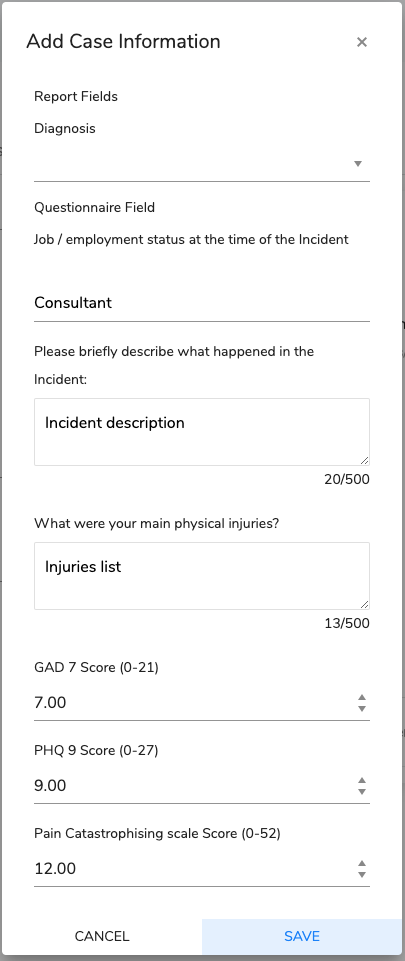

# Additional Case Information

Not all information is available or correct or the receipt of the original case. This dialog is available to add additional case information or quickly correct some information.

The fields store relevant information for reports.

