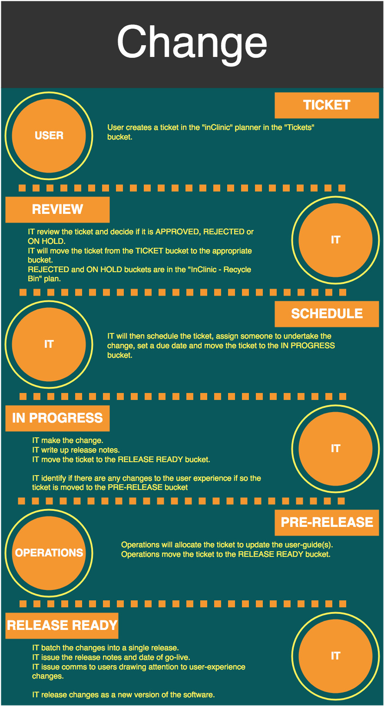

# How tickets are managed

Once a ticket has been created the following steps will happen;

* The IT Director will periodically review tickets
* The IT Director will approve or reject ticket
* The IT Director will schedule approved tickets
* The IT Director will determine if action is required from others and allocate to the Operations Director
* The Operations Director will indicate when additional actions are complete
* The IT Director will batch completed tickets into a version release of the InClinic software

## Ticket

User creates a ticket in the "Ticket" bucket in the "InClinic" plan \(see guidance link below\).



## Review

The IT Director will review tickets and label the task as either a "bug" or "idea" using the label functionality in MS Planner and will determine if any ideas are approved, put on hold or rejected. The ticket will be moved to the appropriate bucket i.e. the approved bucket. The "on hold" and "rejected" buckets are housed on a different board "InClinic - Recycle bin".

### Reject or on hold

When determining if an idea is reject or put on hold the IT director will add a comment to the ticket outlining the reason for the decision.

## In Progress

When an idea or bug is picked up to work on the IT director will move it to the "In progress" bucket. Work will start on making the change. IT will write release notes for the change and identify if there is any change to the user experience i.e. new functionality or a change to the look.

## Pre-Release

In the event that there is a change to the user experience IT will add a checklist item "update user-guide" and will assign the ticket to the operation director and move it to the "Pre-release" bucket.

## Release Ready

Operations will assign the ticket to update the user-guidance. The person who completes the last action in the checklist will move the ticket to the "Release ready" bucket.

### Batch and release

The IT director will collate all tickets in the release ready bucket into a version release and will mark the ticket as complete.

## Release

The release notes will be published, a date selected for go-live and a version number allocated. IT will then notify all users of the imminent change drawing attention to any changes to the user experience.

