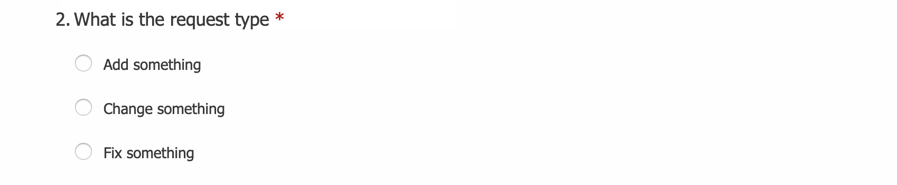
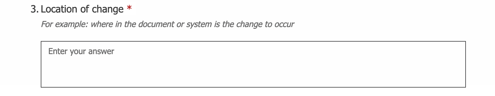
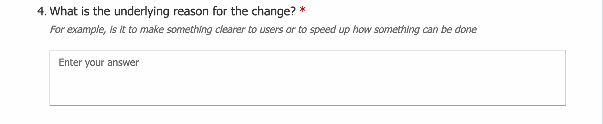
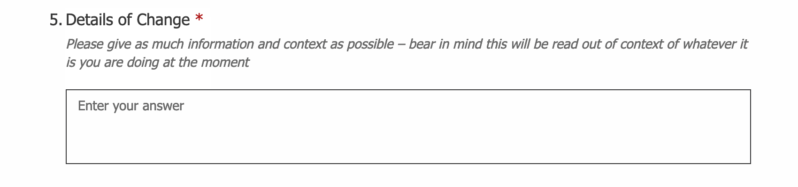
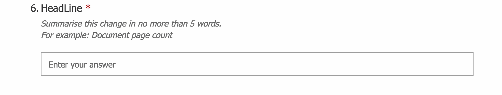
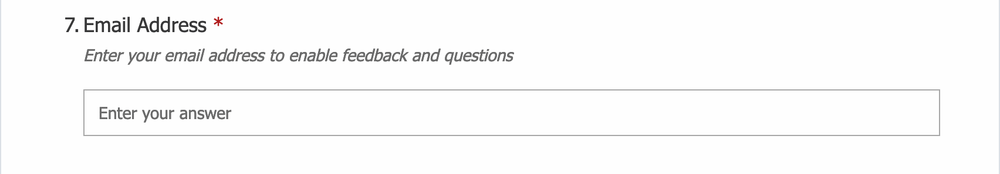

# Raising Tickets

If you would like something changed in inClinic please submit a change request using the form [here](https://forms.office.com/Pages/ResponsePage.aspx?id=OZ9CmnYTa0e08oll5eryafi612vFa3FMlPh5JNAuBXhUNzRYUUlLQURIWDFMWEFHT01aM0FMQ0dMVy4u).

This will take you to the change request form. Answer the following 7 simple questions;

There are 3 options available in the drop down

* inClinic - for any changes to be made to the inClinic system
* Report Templates - for  changes to be made to any report template
* Service Level Agreement - for changes to be made to the affiliate service level agreement

We have these options so that the request goes to the appropriate person.

**Add something -** if you have an idea to introduce something new

**Change something -** if you think a change would improve something

**Fix something -** if something is broken or out of date

We have these categories to help us prioritise the requests.

Specify where the change needs to be made. If it is not specific to one area give an example e.g. if submitting a change request to the date format in inClinic you might put "date format e.g. Task, Overview, DoB". If the change relates to a template or the SLA indicate under which heading the change would sit e.g. Adult RTC, My Opinion, Prognosis 4.10.

Help us understand what is driving this request For example changing the date format might be to "allow easier transcription of data to reports".

This can help ensure the change we design is aligned with the original reason for the change.

This is where you describe the change you want. Provide as much information as you can. If you have a notion of how something might be fixed write it up here. The solution you describe may not be the solution used but it will help provide useful insight.

Enter here as short a summary as you can of the issue you have described above. This will be the heading of the ticket so needs to make sense out of context. For example "change date" would not be as meaningful as "change date format". But also try to keep it to 5 words or less so that those reviewing the ticket can quickly identify what it is for.

Enter your work email. This is needed to identify who has submitted the request \(there is no log-in for the form\).

This allows us to acknowledge your change request and to keep you informed of its progress.

Finally click the submit button

This will enter the information you have entered directly into the appropriate change request management system and will notify the responsible person. Any change that is not a bug fix will be taken to the \(weekly\) management meeting for discussion and prioritisation.

