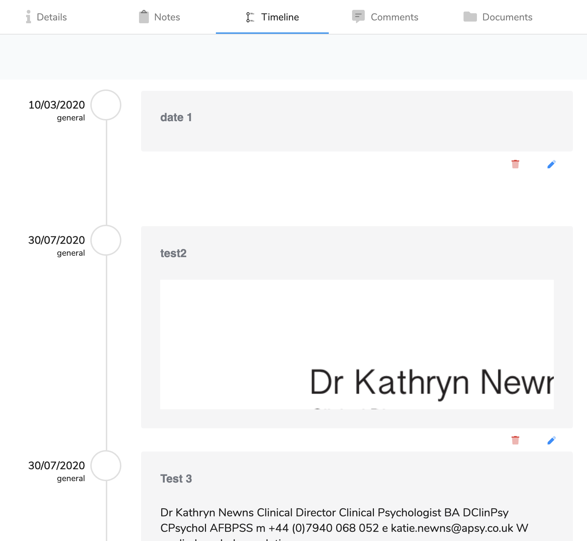

# Timeline \(tab\)

## Overview

This is utility for clinician to map the timeline of a client. It includes the date of birth \(Created from the client\) and the date of the incident \(Created from the Case\). The rest of the entries are created by the clinician or administrator.

## View

This is the initial view of the timeline and shows all entries.

You can click  Add to add a new timeline entry, or under each entry there is two buttons. The first  removes an entry and the other  allow you to edit an entry.

## Add/Edit

To Add or edit an entry then you can click  Add to add a new timeline entry or  allow you to edit an entry:

1. \[Required\] The first field is type and the options are Event, Entry or Extract. The 'Event' type is to add significant milestones. The 'Entry' type is for general entries and finally the 'Extract' is for identifying extracts that are from third party documents. If the extract is assigned then you have further options to identify the source of the document.
2. \[Required\] The date of the entry/Event.
3. \[Required\] A header for the entry to make easily identifiable.
4. The next field is the body text of the event where a more detailed description can be created. It is a full WYSIWYG editor. It has a special feature called OCR. The OCR button will allow you upload a scan or image of text and convert it into a editable text.
5.  If 'Extract' Type is chosen then you have additional fields:
   1. The Manifest Entry drop down enables you to select from the recorded manifest of documents. It will automatically fill the remaining fields if it exists.
   2. The Title field is for the document title
   3. The Author field is for the author of the document
   4. Written on is for date of the document creation

