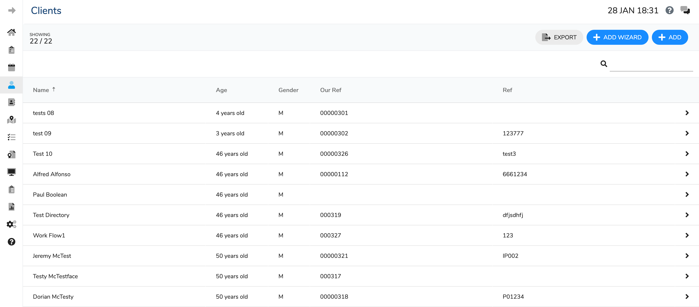

# Clients List

The page is split into four areas:

1. ToolBar
2. Filter Bar
3. Client Table Header
4. Client List

### Toolbar

The toolbar has on the left shows the number of clients. It is split into the number on clients showing versus what is available.

The right hand side has three buttons:

| Button | Purpose |
| :--- | :--- |
|   | This exports the client list to a pdf |
| + Add Wizard | This opens the add client wizard. |
|   | This open the Add client page |

### Filter Bar

This has one field to enter a text filter indicated by a  icon. This will filter the clients list by any text entered into this field.

### Table Header

This contains the header information for the table. It has two features:

1. Sort: If you click on any of the headers it will sort to that field. If you click it again it will reverse the sort and clicking it again will remove the sort.
2. Filter: Each field is filterable by clicking on the  icon and a small pop-up will open giving you options to consider.

### Table List

This is the list of available clients. If you wish to open one click the line.

