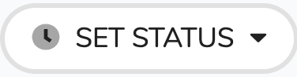
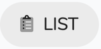

# How do I complete an appointment?

1. Open the clinic worksheet.
2. In the appointment list select the client \(normally this would be the first in the list\).
3. \[Required\] Click to set the status of the appointment. This is an important first step to the appointment and [triggers other functions in the system](../details.md#activating-the-task-templates). In normal circumstances you would either set it to Attended or Did Not attend.
4. When you have finished your session you can scan your notes and upload to inClinic via the documents tab remembering to set a type 'Annotated Template'. See [Documents Section](../../../misc./documents.md) for further information.
5. To select the next client either clickfor the next due in the clinic or click to bring up the appointment list and choose the required client.

