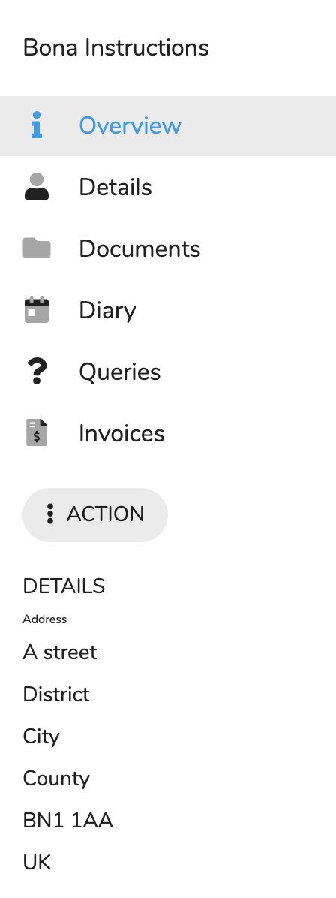

# Contact View

## Overview

The contact defines a party that is related to client either by family or is their solicitor or a third party referring the client to us.

After clicking on the contact you will see the contact navigation and overview. On the lefthand side is the navigation panel and the right hand side displays the related page.

This gives access to the contacts details, stats, documents, prices, invoices, etc.

### Navigation Panel

<table>
  <thead>
    <tr>
      <th style="text-align:left"></th>
      <th style="text-align:left"></th>
    </tr>
  </thead>
  <tbody>
    <tr>
      <td style="text-align:left">
        
      </td>
      <td style="text-align:left">
        
The Navigation panel is split up into four main areas:

        <ol>
          <li>Contact Name</li>
          <li>Navigation buttons</li>
          <li>Actions Button</li>
          <li>Address</li>
        </ol>
        
<b>Contact Name</b>
        

        
&lt;b&gt;&lt;/b&gt;

        
This is the contacts name.

        

        
<b>Menu Items</b>
        

        
&lt;b&gt;&lt;/b&gt;

        <ul>
          <li><b>Overview - </b>An overview stats page.</li>
          <li><b>Details - </b>A page to edit and view the contact details.</li>
          <li><b>Documents - </b>A place to hold contact specific documents.</li>
          <li><b>Diary - </b>The appointments that have been assigned to clients received
            from these contacts.</li>
          <li><b>Queries - </b>The Queries received from this contact.</li>
          <li><b>Invoices - </b>The Invoices that this contact has to pay.</li>
        </ul>
        
<b>Address</b>
        

        
&lt;b&gt;&lt;/b&gt;

        
On clicking this you will be presented with a list of actions:

        
&lt;b&gt;&lt;/b&gt;

        
<b>Actions</b>
        

        
&lt;b&gt;&lt;/b&gt;

        
This is the contacts address.

      </td>
    </tr>
  </tbody>
</table>

### Page Panel

This is where the pages that have been selected are displayed it defaults to the overview.

