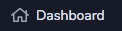

# Dashboard

## Overview

This is the page that opens automatically on logging in. It gives you a snapshot of relevant information. To access it via the main menu click the 'Dashboard' menu item.

## Sections

There are a number of sections to the dashboard page each showing different, high-level information.

For each of the sections you may see an arrow \(top right\) this will take you to an area that will provide more information for that section. e.g. clicking on the arrow in the tasks section will take you to the tasks area. These arrows only appear if you have the rights to that particular area.

### Clinic Attendance

This tells you the attendance by percentage of each clinic. The dark blue is for Did Not Attends \(DNAs\) and the light blue for attended. If you hover over each bar it will show the percentage value.

### Cases

This shows the number of active cases.

### Queries

Shows the number of active queries.

### Tasks

This is a review list of your active tasks. If you click on a task then it will take you to task card.

In the tasks section there are stats to let you know the number of late, paused and active tasks.

For more information on Tasks follow the link below.

### Agenda

This shows your appointments for today.

In the agenda section there are stats to let you know how many unconfirmed appointments there are and, of which, how many are in the next 2 weeks and next week.

For more information on appointments follow the link below.

