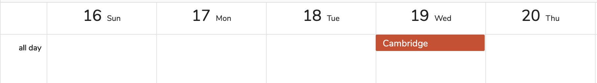
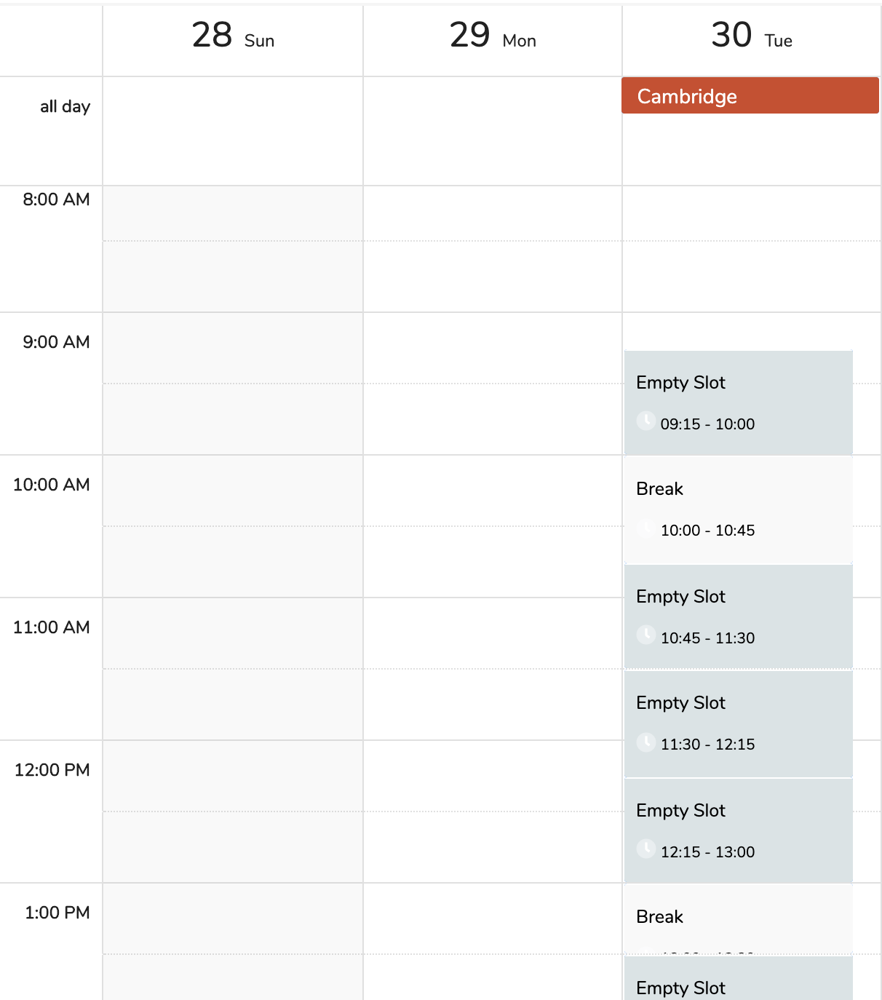

# Diary

## Overview



There is three main areas:

1. Main Toolbar \(At the top\).
2. Filter Toolbar \(Below the main toolbar\).
3. Schedular.

### Toolbar

The toolbar above the schedular is for views and navigation of the schedular. 

The left side is for navigation:

| Label | Purpose |
| :--- | :--- |
| TODAY | Moves the schedular to todays date. |
|   | Move the previous time period \(defined by the view\) |
|   | Move to the next time period \(defined by the view\) |
| The Date | Clicking on this will expose a calendar for navigation. The calendar show the clinic days with an indicator under the date. It is mainly for information. |
| WEEK | Changes the view of the schedular \(defaults to WEEK\). The options are Day,Week, Month Agenda |
| ACTION | Action menu includes 2 options:  1. Create Clinic Sheet 2. Add Appointment |

### Filters/Actions

On the left there is a small calendar for selecting a date. The clinic days are indicated by a small blue dot under the date. The selected date is reflected by the bigger calendar \(schedular\).

Below that are two action buttons. The first is for creating a clinic list and the second is for adding an appointment.

Finally below that is the two filters:

1. A filter for clinician
2. A filter for venue

### Schedular

The schedular is there to show appointment and clinic Days. On the top you will see schedular you will see the clinic 

Under each clinic day you will see the slots and whether they are filled or not.

If you click on an "empty slot" then you can add an appointment to that slot or if you click on filled slot \(appointment\) then you can view or edit it. The slots are colour coded:

* light grey - Empty Slot
* very light grey - Breaks
* dark grey - Unconfirmed Appointment
* Coloured - Confirmed Appointment \(Will be set to the colour of the clinic\)

## Walkthroughs





