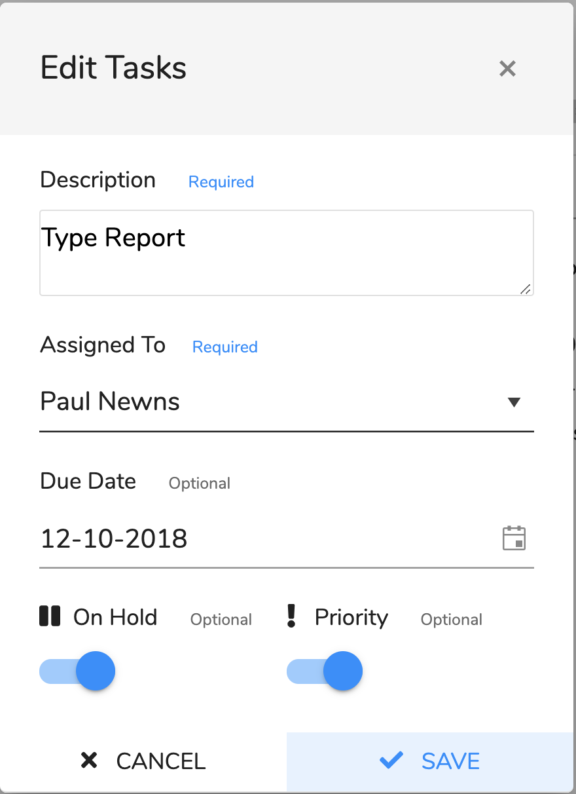

# Edit the Task

## Overview

This dialog is for editing tasks. You can edit tasks that were created by you or created for you by the workflow system. You cannot change tasks that have been assigned to you apart from certain aspects like assigning it to someone else, completing or putting on hold.

## Editing

1. Open the task dialog from the action menu.
2. \[Optional\] edit the description.
3. \[Optional\] change who it is assigned to via the dropdown.
4. \[Optional\] Change the due date by selecting a new date.
5. \[Optional\] Change the 'On Hold' switch.
6. \[Optional\] Change the 'Priority' switch.
7. Either save the changes by clicking 'SAVE' or discard change by clicking 'CANCEL' or the cross in the header.

