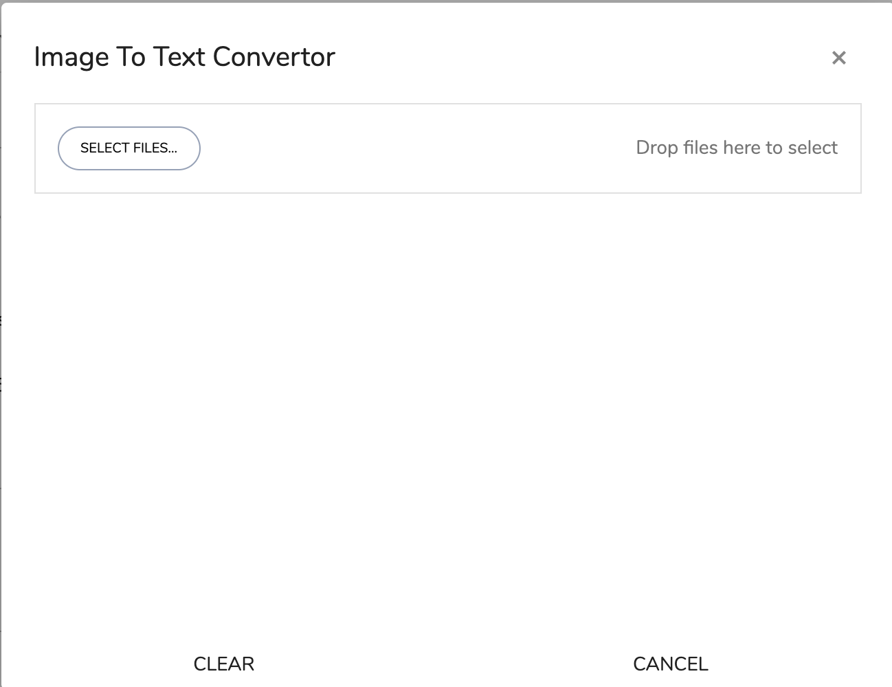
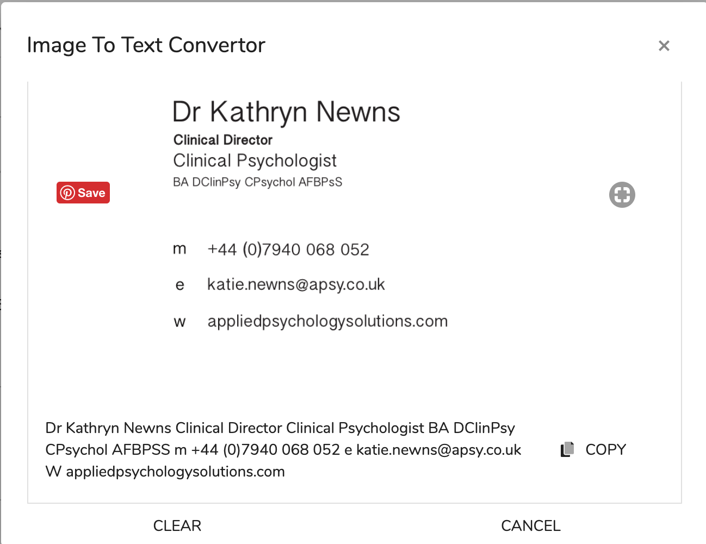

# OCR View

## How do I convert images to text?

1. Click Action in the task page. Which opens the dialog as seen below:
2. Click select files...
3. Select the file or files that you want to convert and click open.
4. The images and the converted texts are displayed below:    
5. Then click the copy button which copies the converted text to the clipboard.

 

