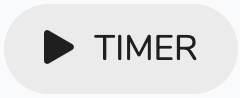

# Task Card

## Overview

This is a worksheet for the task. It displays information about the and ways of interacting with the task and other related information.

## Display

The display contains two main areas the header and the tabs area:

### Header

1. Shows the status of the task
2. An action to run a timer.
3. An Action menu:

   | Title | Description |
   | :--- | :--- |
   |   | Completes or un-completes the task |
   |   | Pauses the task or unpauses |
   |   | Edit the task |
   |   | Fill the word template fields |
   |   | Add additional information to the case |
   |   | Delete Task |
   |   | View Client |
   |    View OCR | Convert multiple images to Text |

4. The task description and client name
5. The due date of the task.

### Tabs

The tab areas are for interaction and further information:

| Tab Name | Description |
| :--- | :--- |
|   | The overview shows related information to the task like the client, case, and incident information and also show a comment input area. |
|   | The documents tab shows the case or the queries documents.. See [Documents](../../misc./documents.md). |
|   | This shows case notes. |
|   | This shows any queries related to the case. |
|   | This shows all charges related to the parent\(eg. appointment\) |

## Actions

### Timer    

When you are in the appointment click on the  button. This will start a timer that will count up in minutes. The timer will show with in the button. If you want to pause it click on it again and if want to restart it click on it again.

###  Complete

This completes the task. If this is a chain of tasks then it will activate the next one in the list. 

If the task is already completed and you want to reverse it then it will look like this .

###  Set to Hold

This puts the task and if there is a related case on hold. The task stays on hold until you are ready to take it off hold. If the task is on hold and you want to release it then the action will look like this  

###  Edit

This enables the editing of the task. See below for the link for more information:



###  Fill Word Template

This opens a dialog to fill a word template. For more information see the link below:



###  Add Case Information

This opens a dialog to add additional case information.



###  Delete Task

This deletes the task.


Deleting the task is a big deal - You cannot delete tasks that are part of a chain.


###  View the client

This opens the client page. See link below for further information:

###  View OCR

This opens a dialog box to enable the upload of images to convert to text.



