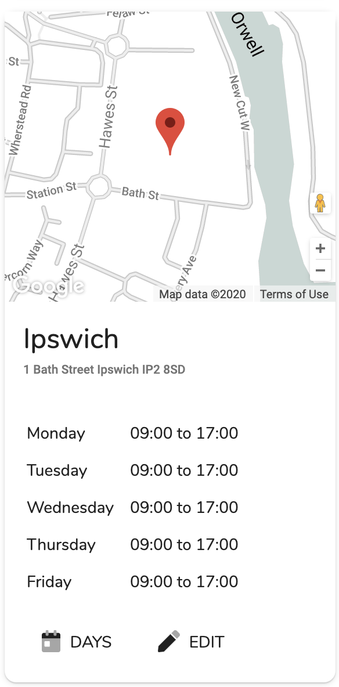

# List

## Overview

This shows a list of venues by card. Each card shows a location, opening times and buttons to further tasks. 

## Actions

### Task Actions

There are two available task actions which are visible at the bottom of each card.

1. Clickinggives access to the [days page](days.md) which allows the user to add/edit the days that the venue is available to book.
2. Clickingopens the [add/edit page](add-edit.md) which enables the user to edit the clinic details.

### Page Actions

There are two page action see at the top of the page.

1. Clickingwill take the user to the venues [statistics page](statistics.md).
2. Clickingopens the [add/edit page](add-edit.md) to create a new venue.

## Search

There is a search field at the top right which will filter the clinic cards down by name and address.

