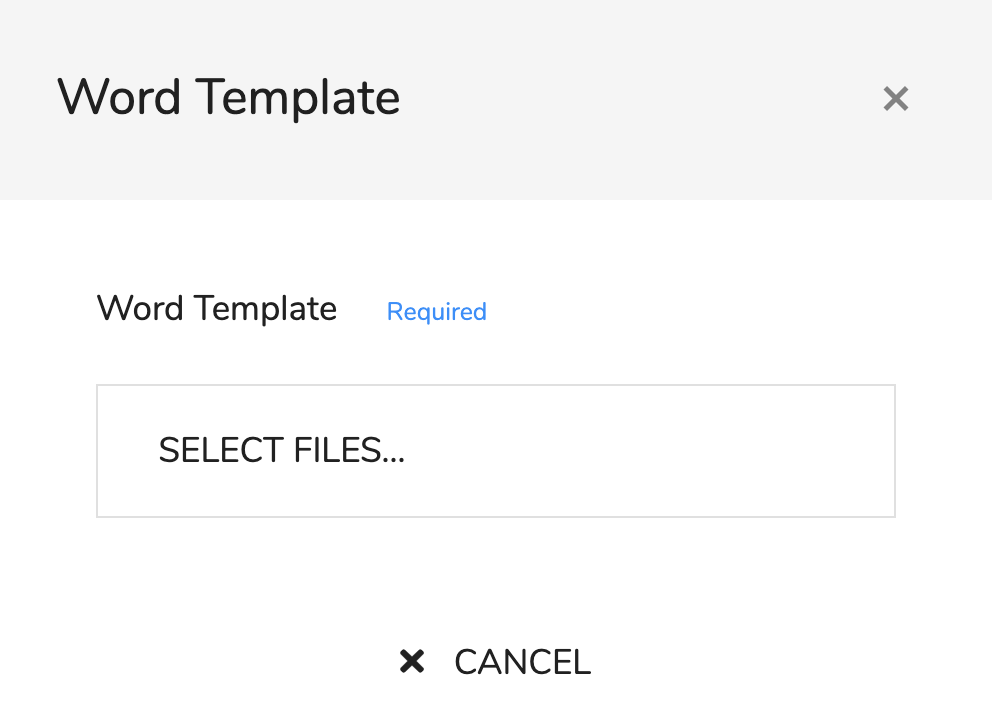
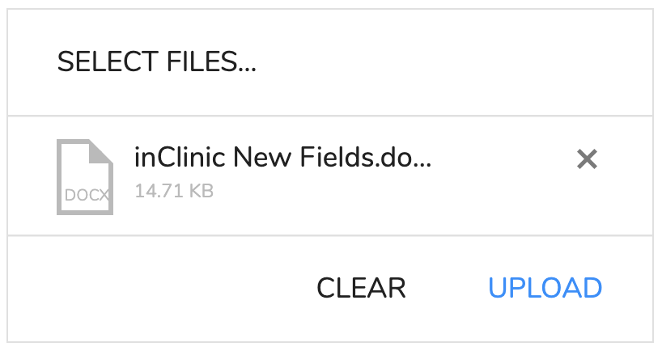

# Word Templates

## Overview

You can create a Microsoft Word document that can by filled in by inClinic.The word document needs to have field indicator added to it and then it can be uploaded to inClinic be processed. After a short time the document will be downloaded to your computer and the fields will be replaced with the data from inClinic. This is a little bit like mail merge in Microsoft Office.

## Preparing a Word Document 

A word document needs to have the fields typed into it. The fields list is located below:



The fields list is the same as the ones used in the [letter templates](../dashboard/overview/letter-templates.md) an the [SMS templates](../dashboard/overview/sms-templates.md). 

If I wanted to add the clients full name and age to a document I would look up the two relevant fields:

| Data Item | Description | Type | Example | Field Name |
| :--- | :--- | :--- | :--- | :--- |
| Claimant Name | Claimant's full name | Text | Mr Paul Newns | {client.fullName} |
| Claimant Age | Claimant's Age | Text | 45 | {client.age} |

The field name that inClinic recognises are the Field Names at the end, so If wanted to write the sentence:

> Mr Paul Newns, a 45 year old man arrived at the clinic in a dishevelled manner.

Then I would write in the document:

```text
{client.fullName}, a {client.age} year old man arrived at the clinic in a 
dishevelled manner.
```

There are other things you can do to tweak the text too. You can use pipes \| to format the data in some cases. So if you wanted to write:

> The appointment is on 1 February 2020 at 1:30pm.

Then you would write:

```text
The appointment is on {appointment.date|dateLong} at {appointment.time|time12}.
```

Check out the data dictionary for more options.

## Filling in a word Document

There are two places to open the dialog to fill in word templates. The first is in the client page and the other is in the task page.

The process is simple. Once you have opened the dialog then:



1. First click 'SELECT FILES...'. This will open a file dialog.
2. Navigate to the word file and select open.
3. The dialog will now show the file you selected

    now click on 'UPLOAD'. 

4. The file will automatically be downloaded with the fields filled in.

