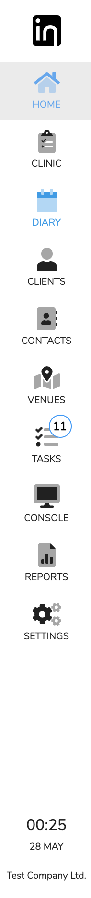

# Navigation

## Main Menu

Down the left hand side is the main menu. Depending on your role it will displays different pages of InClinic e.g. dashboard, dairy, tasks, reports.

On tasks is a badge to show the number of active tasks. At the bottom is the time, date and which company you are logged into.

## Title Bar

Across the top of the remainder of the screen is the title bar.

On the left side is the label to show where you are in the application. On the far right is four controls.

|  |  |
| :--- | :--- |
|  Search Clients | This is an area to search for active clients |
|  | This opens an SMS communication area |
|  | Opens this help documentation |
| PN | This is user avatar. When clicked will open a menu with 3 options: 1. CPD 2. My Details 3. Log Out |

