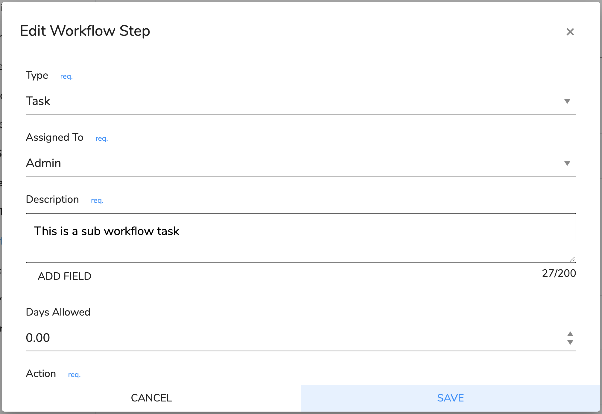

# Workflow Templates

## What are workflow templates?

Workflow templates are a list of tasks that are used to create active tasks for users when an event has occurred. You can assign workflow templates to an appointment and when the appointment is complete  you are then asked if you want to create the tasks associated with it.


 Workflow Templates are the super power to creating automated workflow in your business.


## How do I create a workflow template?

1. Under settings choose 'Workflow Templates'
2. Click the Add button and you will the Workflow Template Form.
3. You will need to give the template a name, preferably something that is meaningful to its purpose.
4. \[Optional\] You can add a description. This is optional and is there as an aide memoire.
5. Now you can add the workflow template steps. These are converted into tasks when the template is applied. See ["How do I add/edit a workflow step"](task-templates.md#how-do-i-add-edit-a-workflow-step).
6. Once you have added all the steps then click the  Save button and you will be taken back to the list.

## How do I add/edit a workflow step?

1. Click the  Add button below the description field or click the  edit button at the end of the appropriate workflow step. This will open a dialog box:               
2. The first field is type, which defaults to 'Task'. The options are:
   1. Task - Default step Type
   2. Question - Ask the user a question with a Yes/No answer.
   3. If...then - If conditions are satisfied then do one thing else do something else \(beta\)
   4. Workflow - Active a new workflow
3. Next you can define whom it is going to be assigned too. It can either be admin, practitioner or bot. If a practitioner is activating the tasks creation then who ever has been assigned to them in the user settings will be assigned the admin tasks. If an admin person is activating the task then whoever is assigned to the client case is assigned to the practitioner tasks. Finally if a bot assigned to the task the task will be completed automatically doing any actions that have been assigned to it \(see step 4\).
4. Then you must fill in the description. When you edit this you will see a maximum number of characters and a button to add fields to the text. These fields are place holders for the records data. [See data dictionary.](../technical-user-guides/data-dictionary.md)
5. To calculate the due date of each task you can assign the number of days that can be taken on each task.
6. The last column 'Action' means when the task is completed then do an additional operation. If the step type is 'Question' or 'If...Else' then you can choose the true \(yes\) or false \(no\) path. The options are continue in the workflow, end the workflow and clean up any other tasks or activate a new workflow. If the step type is 'Workflow' you are able to choose the workflow to activate. All these require an action. Finally if the step type is 'Task' you can choose an optional action on completion. Currently this can be:
   1. Complete Parent - close the case or query associated with the task.
   2. Create Invoice - create an invoice from the associated parent case or query. 
   3. Remove Charges - remove all charges from associated parent.
   4. Add Charges - Add charges to the associated parent.
   5. Send SMS - Send a SMS from template.
   6. Send Email - Send email from template.
7. Then click the Save  button to add the line. You can repeat this task if you wish to add more task steps. On the completion of each step the next one in the list will be activated.

## How do I reorder a workflows steps?

This is quite simple to do. All you need to do is grab the icon which will pick up the line and drag it to the correct position the  tasks will be renumbered automatically.

