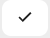

# Workflow Templates

## What are workflow templates?

Workflow templates are a list of tasks that are used to create active tasks for users when an event has occurred. You can assign workflow templates to an appointment and when the appointment is complete  you are then asked if you want to create the tasks associated with it.


 Workflow Templates are the super power to creating automated workflow in your business.


## How do I create a workflow template?

1. Under settings choose 'Workflow Templates'
2. Click the Add button and you will the Workflow Template Form.
3. You will need to give the template a name, preferably something that is meaningful to its purpose.
4. \[Optional\] You can add a description. This is optional and is there as an aide memoire.
5. Now you can add the workflow template steps. These are converted into tasks when the template is applied. Click the  Add button below the description field.
   1. In the line add the task text, this is required. When you edit this you will see a maximum number of characters and a button to add fields to the text. These fields are place holders for the records data. [See data dictionary.](../technical-user-guides/data-dictionary.md)
   2. You can also define whom it is going to be assigned too. It can either be admin, practitioner or bot. If a practitioner is activating the tasks creation then who ever has been assigned to them in the user settings will be assigned the admin tasks. If an admin person is activating the task then whoever is assigned to the client case is assigned to the practitioner tasks. Finally if a bot assigned to the task the task will be completed automatically doing any actions that have been assigned to it \(see step 4\).
   3. To calculate the due date of each task you can assign the number of days that can be taken on each task.
   4. The last column 'Action' means when the task is completed then do an additional operation. Currently this can close the case or query associated with the task, create an invoice from the associated appointment or change the task into a question. Questions are designed to instigate a new task template depending on the task template assigned to the No and Yes responses.
   5. Then click   button to add the line. You can repeat this task if you wish to add more task steps. On the completion of each step the next one in the list will be activated.
6. Once you have added all the steps then click the  Save button and you will be taken back to the list.

### How do I reorder a workflows steps?

This is quite simple to do. All you need to do is grab the icon which will pick up the line and drag it to the correct position the  tasks will be renumbered automatically.

